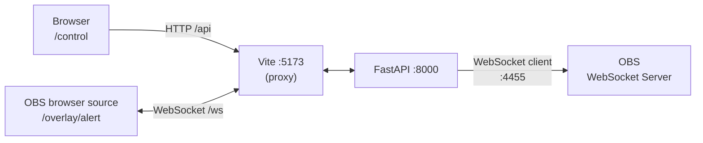

# sang_suite

A self-hosted streaming tools suite: a **FastAPI** backend plus a **Vue 3** frontend that serves both a
control panel and transparent browser-source overlays for OBS.

Click a button in the control panel and an alert appears on your stream. Toggle OBS sources and switch
scenes from the same dashboard. Everything runs locally — no cloud service, no public URL.

## Features

- **Alert overlay** — a transparent page you drop into OBS as a browser source; alerts pushed over a
  WebSocket appear instantly with no page reload.
- **OBS control** — switch scenes and show/hide sources straight from the control panel, via OBS's own
  WebSocket API.
- **Live status** — the control panel shows backend health and WebSocket connection state at a glance.
- **Auto-reconnect** — overlays recover on their own if the backend restarts mid-stream.

## Architecture

The thing worth understanding up front: there are **two different WebSockets**, pointing in opposite
directions.



| | `/ws` (alert relay) | `OBSController` |
|---|---|---|
| Backend's role | **server** | **client** |
| Direction | browser dials **in** | backend dials **out** to OBS |
| Library | FastAPI `WebSocket` | `simpleobsws` |

The browser only ever talks to Vite, which proxies `/api` and `/ws` through to the backend on port 8000.
That means **both dev servers must be running**.

## Requirements

- **Python** 3.12+ (developed on 3.14)
- **Node** ^22.18 or >=24.12
- **OBS Studio** 28+ (the WebSocket server is built in from 28 onward)

## Setup

Clone, then set up each half.

**Backend**

```sh
cd backend
python3 -m venv venv
source venv/bin/activate
pip install -r requirements.txt
cp .env.example .env      # then fill in your OBS password
```

**Frontend**

```sh
cd frontend
npm install
```

### Configuring OBS

1. In OBS: **Tools → WebSocket Server Settings** → enable the server, leave the port at `4455`, and copy
   the password.
2. Put that password in `backend/.env`:

   ```
   OBS_WS_URL=ws://localhost:4455
   OBS_WS_PASSWORD=your-password-here
   ```

`.env` is gitignored, so your password never gets committed. The backend starts fine without OBS
running — the connection is lazy, and errors only surface when you press a control button.

## Running

Both servers, in two terminals:

```sh
# terminal 1 — backend on :8000
cd backend && source venv/bin/activate && fastapi dev main.py
```

```sh
# terminal 2 — frontend on :5173
cd frontend && npm run dev
```

Then open **<http://localhost:5173/control>**.

### Adding the overlay to OBS

**Add → Browser Source**, URL `http://localhost:5173/overlay/alert`, size 1920×1080.

In the source's properties, tick **Shutdown source when not visible** and **Refresh browser when scene
becomes active** — OBS caches page assets aggressively, and these save you from clearing the cache by
hand every time the overlay changes.

## Routes

| Route | Purpose |
|---|---|
| `/control` | Control panel — alerts, OBS scene/source controls, status |
| `/overlay/alert` | Transparent alert overlay for an OBS browser source |

## API

| Method | Endpoint | Body | Description |
|---|---|---|---|
| `GET` | `/api/health` | — | Health check, returns `{"status": "ok"}` |
| `POST` | `/api/obs/scene` | `{"scene": "..."}` | Switch the active OBS scene |
| `POST` | `/api/obs/source` | `{"scene": "...", "source": "...", "visible": true}` | Show/hide a source |
| `WS` | `/ws` | — | Alert relay; messages are broadcast to all connected clients |

Alert messages are plain JSON: `{ "type": "alert", "text": "New Follower: Innoruuk" }`

**Error codes worth knowing:** `503` means the backend can't reach OBS (not running, or WebSocket server
off). `502` means OBS is connected but rejected the request — usually a misspelled scene or source name.

## Project structure

```
backend/
  main.py            # the entire backend: relay, OBS controller, routes
  requirements.txt   # pinned deps
  .env.example       # config template
frontend/
  src/
    views/
      ControlView.vue    # /control
      AlertOverlay.vue   # /overlay/alert
    stores/overlay.ts    # Pinia store wrapping the WebSocket
    router/index.ts      # route declarations
  vite.config.ts     # dev proxy for /api and /ws
notes/
  obs-overlay-roadmap.md   # the phased build plan
```

## Development

From `frontend/`:

- `npm run type-check` — run `vue-tsc`; use this to verify TypeScript changes
- `npm run build` — type-check plus a production build

There are no tests or linters configured yet in either half.

**Gotchas**

- Every `.vue` file with a script block must use `<script setup lang="ts">`. Plain `<script setup>`
  compiles fine but breaks `vue-tsc` with TS7016, because `allowJs` is off.
- `<style scoped>` cannot style `body` — scoped rules only match elements the component renders. Use a
  global stylesheet or `:global(body)` for page-level styling.
- Overlay pages need transparent backgrounds. Don't put colors on `body` in the global stylesheet; they
  will leak into your overlays.

## Status

Built in phases following [`notes/obs-overlay-roadmap.md`](notes/obs-overlay-roadmap.md).

- [x] **Phases 0–3** — scaffold, backend skeleton, Vite proxy
- [x] **Phase 4** — WebSocket alert relay
- [x] **Phase 5** — overlay running live in OBS
- [x] **Phase 6** — OBS control from Python
- [ ] **Phase 7** — Twitch EventSub (follows/subs fire alerts automatically)
- [ ] **Phase 8** — persistence and a single-process production build
