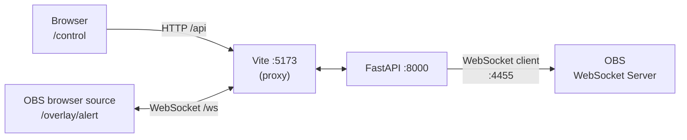

# sang_suite

A self-hosted streaming tools suite: a **FastAPI** backend plus a **Vue 3** frontend that serves both a
control panel and transparent browser-source overlays for OBS.

Click a button in the control panel and an alert appears on your stream. Toggle OBS sources and switch
scenes from the same dashboard. Everything runs locally — no cloud service, no public URL.

## Features

- **Alert overlay** — a transparent page you drop into OBS as a browser source; alerts pushed over a
  WebSocket appear instantly with no page reload. Back-to-back alerts queue rather than overwriting
  each other.
- **Twitch events** — follows, new subs, resubs, cheers, raids and channel point redeems all fire
  alerts automatically via EventSub.
- **Media overlay** — a second browser source that plays clips and gifs, queued so two redeems in a
  row play in order.
- **OBS control** — switch scenes and show/hide sources from the dashboard, picking from dropdowns
  populated by OBS itself.
- **Panic button** — one click clears every queue and blanks both overlays.
- **Reliable delivery** — every event carries a sequence id and the last 50 are replayed to an overlay
  that reconnects, so an alert landing during a blip isn't lost.
- **Live status** — the control panel shows backend health and WebSocket connection state at a glance.
- **Auto-reconnect** — overlays recover on their own if the backend restarts mid-stream.

## Architecture

The thing worth understanding up front: there are **two different WebSockets**, pointing in opposite
directions.


```mermaid
graph LR
    B["Browser<br/>/control"] -->|"HTTP /api"| V["Vite :5173<br/>(proxy)"]
    O["OBS browser source<br/>/overlay/alert"] <-->|"WebSocket /ws"| V
    V <--> F["FastAPI :8000"]
    F -->|"WebSocket client<br/>:4455"| OBS["OBS<br/>WebSocket Server"]
```

| | `/ws` (alert relay) | `OBSController` |
|---|---|---|
| Backend's role | **server** | **client** |
| Direction | browser dials **in** | backend dials **out** to OBS |
| Library | FastAPI `WebSocket` | `simpleobsws` |

The browser only ever talks to Vite, which proxies `/api` and `/ws` through to the backend on port 8000.
That means **both dev servers must be running**.

## Requirements

- **Python** 3.12+ (developed on 3.14)
- **Node** ^22.18 or >=24.12
- **OBS Studio** 28+ (the WebSocket server is built in from 28 onward)

## Setup

Clone, then set up each half.

**Backend**

```sh
cd backend
python3 -m venv venv
source venv/bin/activate
pip install -r requirements.txt
cp .env.example .env      # then fill in your OBS password
```

**Frontend**

```sh
cd frontend
npm install
```

### Configuring OBS

1. In OBS: **Tools → WebSocket Server Settings** → enable the server, leave the port at `4455`, and copy
   the password.
2. Put that password in `backend/.env`:

   ```
   OBS_WS_URL=ws://localhost:4455
   OBS_WS_PASSWORD=your-password-here
   ```

`.env` is gitignored, so your password never gets committed. The backend starts fine without OBS
running — the connection is lazy, and errors only surface when you press a control button.

## Running

Both servers, in two terminals:

```sh
# terminal 1 — backend on :8000
cd backend && source venv/bin/activate && fastapi dev main.py
```

```sh
# terminal 2 — frontend on :5173
cd frontend && npm run dev
```

Then open **<http://localhost:5173/control>**.

### Adding the overlays to OBS

**Add → Browser Source** for each, size 1920×1080:

- `http://localhost:5173/overlay/alert`
- `http://localhost:5173/overlay/media`

In each source's properties, tick **Shutdown source when not visible** and **Refresh browser when
scene becomes active** — OBS caches page assets aggressively, and these save you from clearing the
cache by hand every time an overlay changes.

On the media source also tick **Control audio via OBS**, or clip audio never reaches your mix.

## Routes

| Route | Purpose |
|---|---|
| `/control` | Control panel — alerts, OBS scene/source controls, panic, status |
| `/overlay/alert` | Transparent alert overlay for an OBS browser source |
| `/overlay/media` | Clip and gif overlay — its own browser source |

The two overlays are separate pages on purpose. Sharing one would mean a video and a follow alert
fighting over a single DOM and a single audio context; as separate browser sources they compose and
layer independently in OBS.

## API

| Method | Endpoint | Body | Description |
|---|---|---|---|
| `GET` | `/api/health` | — | Health check, returns `{"status": "ok"}` |
| `GET` | `/api/config` | — | Current widget settings |
| `GET` | `/api/activity` | — | Last 20 events, oldest first; survives restarts |
| `PUT` | `/api/config` | full config object | Replace settings, save to disk, push to overlays |
| `POST` | `/api/panic` | — | Clear every queue and blank both overlays |
| `GET` | `/api/obs/scenes` | — | Every scene, plus which is live |
| `GET` | `/api/obs/sources?scene=` | — | Sources in one scene, with visibility |
| `POST` | `/api/obs/scene` | `{"scene": "..."}` | Switch the active OBS scene |
| `POST` | `/api/obs/source` | `{"scene": "...", "source": "...", "visible": true}` | Show/hide a source |
| `WS` | `/ws` | — | Event relay; messages are broadcast to all connected clients |

Alert messages are plain JSON: `{ "type": "alert", "text": "New Follower: Innoruuk" }`

Twitch alerts add `kind` (`follow`/`sub`/`resub`/`cheer`/`raid`/`redeem`), `user` and `amount`. The
overlay looks `kind` up in the config to pick a headline and accent colour; manual alerts have no
`kind` and use the `generic` entry.

Media messages are their own type, read only by `/overlay/media`:
`{ "type": "media", "src": "/media/videos/bait.webm", "title": "...", "user": "...", "interrupt": false }`

### Delivery guarantees

Every broadcast except `config` and `panic` is stamped with a monotonic `id` and kept in a 50-message
history. A client sends `{"type": "hello", "last_id": N}` on connect and is sent only what it missed.
`hello` is handled by the endpoint and never relayed.

The client's watermark lives in module scope, not `localStorage` — deliberately. It survives the
reconnect loop (a backend restart, a network blip) but not a page reload, so a browser source opening
fresh mid-stream starts clean instead of dumping an hour of backlog onto your canvas.

The last 20 events are also written to gitignored `backend/activity.json`, which backs the dashboard's
activity feed and outlives both a page refresh and a backend restart. The sequence counter is saved
alongside them: if it reset to 1 on reboot, an overlay still holding a higher `last_id` would see
every new event as older than what it had already seen and receive no replay at all.

## Settings

Alert duration and per-kind labels/colours live in `backend/config.json`, editable from `/control`.
Saving does two things: writes the file, and broadcasts the new config over `/ws` — so changes land
in OBS immediately without refreshing the browser source.

The file is gitignored and entirely optional. Defaults live in the Pydantic models in `main.py`, so
a fresh clone runs with no config file and only writes one the first time you hit Save. A malformed
file logs a warning and falls back to defaults rather than stopping the server.

**Adding an alert kind takes two edits, not one.** `config.json` replaces `kinds` wholesale at load,
so a key added only to `DEFAULT_KINDS` never reaches the overlay on a machine that already has a
config file. Add it to both.

### Channel point rewards

`config.json` also carries a `rewards` section mapping **reward id** to what should happen:

```json
"rewards": {
  "59640e4f-7e7a-4f8f-968d-23b4958bee88": {
    "label": null,
    "actions": ["alert", "media"],
    "media": "videos/bait.webm",
    "interrupt": false
  }
}
```

- **Keyed by id, never title** — titles get renamed on a whim, ids are stable.
- **`label: null`** uses the reward's own Twitch title, so renaming a reward updates the alert for free.
- **`actions`** may contain `alert`, `media`, or both.
- **`interrupt`** decides whether a clip cuts in or waits its turn.

Redeeming a reward that isn't listed prints a copy-pasteable line instead of alerting, which is how
you discover ids:

```
[redeem] unconfigured reward 'Play a clip' id=9c8b7a6d-… cost=5000 -- add it to config.json
```

## Clips and gifs

Media lives in `backend/media/` (gitignored) and is served at `/media`. Drop a file in, reference it
from a reward's `media` path, and restart — no rebuild, and no video in git.

**Encode clips as WebM (VP9 + Opus).** OBS's bundled CEF on Linux frequently ships without
proprietary codecs, so an H.264/AAC MP4 can play silently, or not at all, *while working perfectly in
your normal browser*. That asymmetry makes it a genuinely nasty afternoon to debug.

```sh
ffmpeg -i clip.mp4 -c:v libvpx-vp9 -crf 32 -b:v 0 -row-mt 1 \
       -c:a libopus -b:a 128k clip.webm
```

Gifs and webp play as images. They loop forever with no `ended` event, so they're shown on a fixed
timer rather than chained on playback.

**Error codes worth knowing:** `503` means the backend can't reach OBS (not running, or WebSocket server
off). `502` means OBS is connected but rejected the request — usually a misspelled scene or source name.

## Project structure

```
backend/
  main.py            # the entire backend: relay, OBS controller, routes, settings
  twitch.py          # EventSub client — follows, subs, resubs, cheers, raids, redeems
  chat.py            # bot chat sending (stub; Phase 12)
  requirements.txt   # pinned deps
  .env.example       # config template
  config.json        # widget settings + reward routing, written by /control (gitignored)
  activity.json      # last 20 events, for the dashboard feed (gitignored)
  media/             # clips and gifs, served at /media (gitignored)
frontend/
  src/
    views/
      ControlView.vue    # /control
      AlertOverlay.vue   # /overlay/alert
      MediaOverlay.vue   # /overlay/media
    stores/overlay.ts    # Pinia store wrapping the WebSocket
    audio/sounds.ts      # synthesised per-kind jingles
    router/index.ts      # route declarations
  vite.config.ts     # dev proxy for /api, /ws and /media
notes/
  obs-overlay-roadmap.md         # phases 0–8
  obs-overlay-roadmap-part-2.md  # phases 9–13
learning/
  how-it-works.md    # a walkthrough of the whole system
```

## Development

From `frontend/`:

- `npm run type-check` — run `vue-tsc`; use this to verify TypeScript changes
- `npm run build` — type-check plus a production build

There are no tests or linters configured yet in either half.

### Production mode (one process)

Development needs two servers, but for actually streaming you can collapse to one:

```sh
cd frontend && npm run build      # writes frontend/dist/
cd ../backend && source venv/bin/activate && fastapi run main.py
```

FastAPI serves `frontend/dist/` at `/`, so point OBS at `http://localhost:8000/overlay/alert` and
stop running Vite. The mount is registered last and skipped entirely when `dist/` is absent, so this
changes nothing about the dev workflow — if you haven't built, the backend just logs a note and
serves the API alone.

Because `/control` and `/overlay/alert` are client-side routes with no file on disk, unmatched paths
fall back to `index.html` and let vue-router take over. Paths under `/api` are excluded from that
fallback so a wrong endpoint still returns a JSON 404 instead of a page.

Remember to rebuild after frontend changes — in this mode the backend serves whatever was in `dist/`
at request time, not your working tree.

**Gotchas**

- Every `.vue` file with a script block must use `<script setup lang="ts">`. Plain `<script setup>`
  compiles fine but breaks `vue-tsc` with TS7016, because `allowJs` is off.
- `<style scoped>` cannot style `body` — scoped rules only match elements the component renders. Use a
  global stylesheet or `:global(body)` for page-level styling.
- Overlay pages need transparent backgrounds. Don't put colors on `body` in the global stylesheet; they
  will leak into your overlays.

## Status

**v1.0.** Built in phases following [`notes/obs-overlay-roadmap.md`](notes/obs-overlay-roadmap.md)
and [part 2](notes/obs-overlay-roadmap-part-2.md).

- [x] **Phases 0–3** — scaffold, backend skeleton, Vite proxy
- [x] **Phase 4** — WebSocket alert relay
- [x] **Phase 5** — overlay running live in OBS
- [x] **Phase 6** — OBS control from Python
- [x] **Phase 7** — Twitch EventSub (follows/subs fire alerts automatically)
- [x] **Phase 8** — persistence and a single-process production build
- [x] **Phase 9** — sequence ids and replay, so a reconnect blip can't swallow an event
- [x] **Phase 10** — channel point redeems, routed per reward
- [x] **Phase 11** — the media overlay, queueing and the panic button
- [ ] **Phase 12** — the bot speaks (needs a second OAuth token as the bot account)
- [ ] **Phase 13** — loot boxes

### Known gaps

- Resubs alert, but **gift-sub gifter announcements**, `stream.online`/`offline` and unsubs are not
  subscribed yet. All three need no new OAuth scopes.
- The OBS dropdowns are a snapshot, not live — press ⟳ after changing scenes in OBS.
- No tests or linters in either half.
